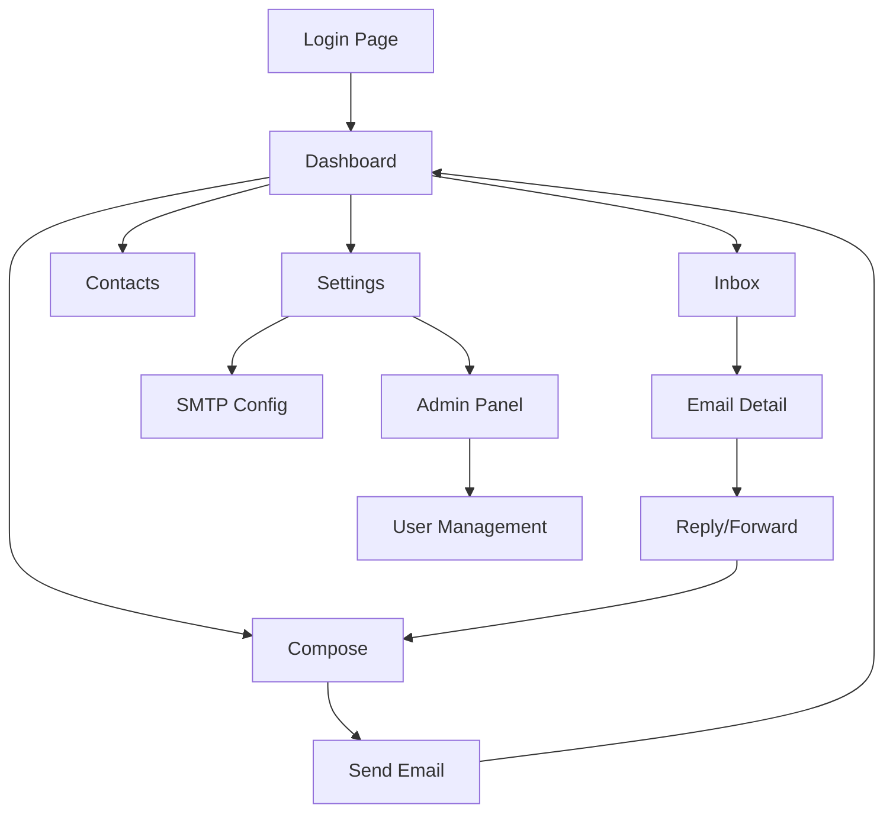

# Email Portal - Product Requirements Document

## 1. Product Overview
A comprehensive web-based email management portal that enables users to send, receive, and organize emails through SMTP connectivity with full inbox management capabilities.

The portal serves as a centralized email client for websites, allowing businesses and individuals to manage multiple email accounts, handle attachments, organize communications, and maintain professional email workflows through an intuitive web interface.

Target market: Small to medium businesses, web developers, and organizations requiring a self-hosted email management solution with complete control over their email infrastructure.

## 2. Core Features

### 2.1 User Roles
| Role | Registration Method | Core Permissions |
|------|---------------------|------------------|
| Admin User | System setup/invitation | Full system access, user management, SMTP configuration |
| Regular User | Email registration/admin invitation | Email management, personal settings, contact management |
| Guest User | Temporary access | Read-only access to shared emails (if enabled) |

### 2.2 Feature Module
Our email portal consists of the following main pages:
1. **Login/Register Page**: User authentication, account creation, password recovery
2. **Dashboard Page**: Email overview, quick stats, recent activity, notifications
3. **Inbox Page**: Email list, filtering, sorting, bulk operations, real-time updates
4. **Compose Page**: Email creation, rich text editor, attachments, templates, scheduling
5. **Email Detail Page**: Full email view, reply/forward options, attachment download
6. **Contacts Page**: Contact management, groups, import/export functionality
7. **Settings Page**: Account preferences, SMTP configuration, signatures, templates
8. **Admin Panel**: User management, system configuration, email server settings

### 2.3 Page Details
| Page Name | Module Name | Feature description |
|-----------|-------------|---------------------|
| Login/Register Page | Authentication | Login with email/password, register new accounts, forgot password, two-factor authentication setup |
| Dashboard Page | Overview Dashboard | Display email statistics, recent emails preview, quick compose button, notification center |
| Dashboard Page | Quick Actions | Fast access to compose, search, and frequently used folders |
| Inbox Page | Email List | Display emails with sender, subject, date, read status, priority indicators |
| Inbox Page | Email Management | Mark as read/unread, delete, archive, move to folders, bulk operations |
| Inbox Page | Filtering & Search | Filter by date, sender, subject, search across all email content |
| Compose Page | Email Editor | Rich text editor with formatting options, HTML/plain text toggle |
| Compose Page | Attachment Handler | Upload files, drag-and-drop support, attachment preview |
| Compose Page | Template System | Save and use email templates, signature insertion, scheduling |
| Email Detail Page | Email Viewer | Full email display with proper formatting, attachment list |
| Email Detail Page | Response Actions | Reply, reply-all, forward, print, download as PDF |
| Contacts Page | Contact Management | Add, edit, delete contacts, organize in groups, import from CSV |
| Contacts Page | Contact Integration | Auto-complete in compose, contact history, merge duplicates |
| Settings Page | Account Settings | Profile management, password change, notification preferences |
| Settings Page | SMTP Configuration | Add/edit email accounts, server settings, authentication |
| Settings Page | Email Preferences | Signatures, auto-reply, email forwarding rules |
| Admin Panel | User Management | Create users, assign permissions, monitor usage |
| Admin Panel | System Configuration | Global settings, backup/restore, security policies |

## 3. Core Process

**Regular User Flow:**
1. User logs in → Dashboard overview → Navigate to Inbox
2. User views emails → Select email → Read/Reply/Forward
3. User composes new email → Add recipients → Attach files → Send
4. User manages contacts → Add/Edit contacts → Organize groups
5. User configures settings → SMTP setup → Signature creation

**Admin User Flow:**
1. Admin logs in → Admin panel → User management
2. Admin configures system → SMTP servers → Security settings
3. Admin monitors usage → View logs → Manage storage

## 4. User Interface Design

### 4.1 Design Style
- **Primary Colors**: Deep blue (#1e40af) for headers and primary actions, light blue (#3b82f6) for accents
- **Secondary Colors**: Gray (#6b7280) for text, white (#ffffff) for backgrounds, red (#ef4444) for alerts
- **Button Style**: Rounded corners (8px), subtle shadows, hover effects with color transitions
- **Font**: Inter or system fonts, 14px base size, 16px for headings, 12px for metadata
- **Layout Style**: Clean sidebar navigation, card-based email list, responsive grid layout
- **Icons**: Feather icons or Heroicons for consistency, email-specific icons for actions

### 4.2 Page Design Overview
| Page Name | Module Name | UI Elements |
|-----------|-------------|-------------|
| Login/Register Page | Authentication Form | Centered card layout, gradient background, clean input fields with icons |
| Dashboard Page | Stats Overview | Card-based metrics, recent email preview cards, floating action button for compose |
| Inbox Page | Email List | Table/list view with alternating row colors, hover effects, checkbox selection |
| Inbox Page | Sidebar Navigation | Collapsible folder tree, unread count badges, drag-and-drop support |
| Compose Page | Email Editor | Full-screen modal or dedicated page, toolbar with formatting options |
| Email Detail Page | Email Content | Clean typography, attachment thumbnails, action buttons in header |
| Contacts Page | Contact Grid | Card-based contact display, search bar, alphabet filter |
| Settings Page | Configuration Tabs | Tabbed interface, form sections with clear labels and help text |

### 4.3 Responsiveness
Desktop-first design with mobile-adaptive layout. Touch-optimized interactions for mobile devices including swipe gestures for email actions, collapsible navigation, and optimized button sizes for touch interfaces.