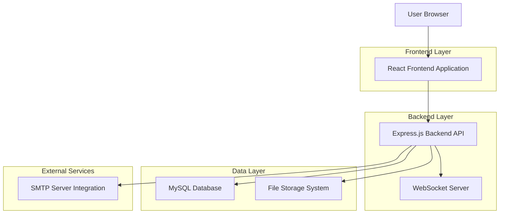
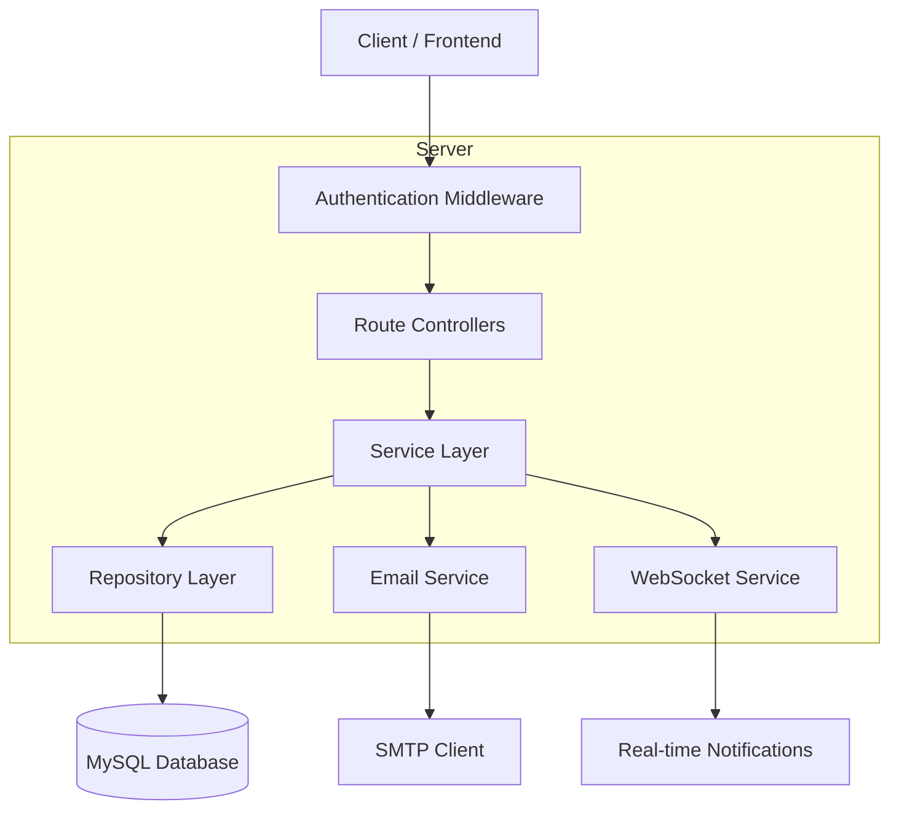
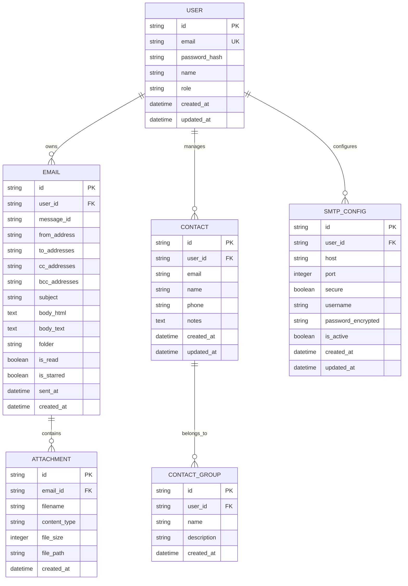

# Email Portal - Technical Architecture Document

## 1. Architecture Design



## 2. Technology Description
- Frontend: React@18 + TypeScript + Tailwind CSS + Vite
- Backend: Node.js + Express@4 + TypeScript + Prisma ORM
- Database: MySQL@8.0
- Email: Nodemailer + IMAP client
- Real-time: Socket.io for WebSocket connections
- Authentication: JWT + bcrypt
- File Upload: Multer + local storage

## 3. Route Definitions
| Route | Purpose |
|-------|---------|
| / | Dashboard page, displays email overview and quick actions |
| /login | Login page, user authentication |
| /register | Registration page, new user signup |
| /inbox | Inbox page, displays email list with filtering and search |
| /compose | Compose page, create and send new emails |
| /email/:id | Email detail page, view specific email with reply options |
| /contacts | Contacts page, manage contact list and groups |
| /settings | Settings page, account and SMTP configuration |
| /admin | Admin panel, user and system management |

## 4. API Definitions

### 4.1 Core API

**Authentication APIs**
```
POST /api/auth/login
```
Request:
| Param Name | Param Type | isRequired | Description |
|------------|------------|------------|-------------|
| email | string | true | User email address |
| password | string | true | User password |

Response:
| Param Name | Param Type | Description |
|------------|------------|-------------|
| success | boolean | Authentication status |
| token | string | JWT access token |
| user | object | User profile information |

```
POST /api/auth/register
```
Request:
| Param Name | Param Type | isRequired | Description |
|------------|------------|------------|-------------|
| email | string | true | User email address |
| password | string | true | User password |
| name | string | true | User full name |

**Email Management APIs**
```
GET /api/emails
```
Query Parameters:
| Param Name | Param Type | isRequired | Description |
|------------|------------|------------|-------------|
| folder | string | false | Email folder (inbox, sent, drafts) |
| page | number | false | Pagination page number |
| limit | number | false | Number of emails per page |
| search | string | false | Search query |

```
POST /api/emails/send
```
Request:
| Param Name | Param Type | isRequired | Description |
|------------|------------|------------|-------------|
| to | string[] | true | Recipient email addresses |
| subject | string | true | Email subject |
| body | string | true | Email content (HTML) |
| attachments | file[] | false | File attachments |

```
GET /api/emails/:id
```
Response:
| Param Name | Param Type | Description |
|------------|------------|-------------|
| id | string | Email unique identifier |
| from | string | Sender email address |
| to | string[] | Recipient email addresses |
| subject | string | Email subject |
| body | string | Email content |
| attachments | object[] | Attachment information |
| createdAt | string | Email timestamp |

**Contact Management APIs**
```
GET /api/contacts
```
```
POST /api/contacts
```
```
PUT /api/contacts/:id
```
```
DELETE /api/contacts/:id
```

**SMTP Configuration APIs**
```
POST /api/smtp/configure
```
Request:
| Param Name | Param Type | isRequired | Description |
|------------|------------|------------|-------------|
| host | string | true | SMTP server host |
| port | number | true | SMTP server port |
| secure | boolean | true | Use SSL/TLS |
| username | string | true | SMTP username |
| password | string | true | SMTP password |

## 5. Server Architecture Diagram



## 6. Data Model

### 6.1 Data Model Definition



### 6.2 Data Definition Language

**User Table**
```sql
-- Create users table
CREATE TABLE users (
    id VARCHAR(36) PRIMARY KEY DEFAULT (UUID()),
    email VARCHAR(255) UNIQUE NOT NULL,
    password_hash VARCHAR(255) NOT NULL,
    name VARCHAR(100) NOT NULL,
    role ENUM('admin', 'user') DEFAULT 'user',
    created_at TIMESTAMP DEFAULT CURRENT_TIMESTAMP,
    updated_at TIMESTAMP DEFAULT CURRENT_TIMESTAMP ON UPDATE CURRENT_TIMESTAMP
);

-- Create index
CREATE INDEX idx_users_email ON users(email);
CREATE INDEX idx_users_role ON users(role);
```

**Email Table**
```sql
-- Create emails table
CREATE TABLE emails (
    id VARCHAR(36) PRIMARY KEY DEFAULT (UUID()),
    user_id VARCHAR(36) NOT NULL,
    message_id VARCHAR(255),
    from_address VARCHAR(255) NOT NULL,
    to_addresses TEXT NOT NULL,
    cc_addresses TEXT,
    bcc_addresses TEXT,
    subject VARCHAR(500),
    body_html LONGTEXT,
    body_text LONGTEXT,
    folder ENUM('inbox', 'sent', 'drafts', 'trash', 'archive') DEFAULT 'inbox',
    is_read BOOLEAN DEFAULT FALSE,
    is_starred BOOLEAN DEFAULT FALSE,
    sent_at TIMESTAMP NULL,
    created_at TIMESTAMP DEFAULT CURRENT_TIMESTAMP,
    FOREIGN KEY (user_id) REFERENCES users(id) ON DELETE CASCADE
);

-- Create indexes
CREATE INDEX idx_emails_user_id ON emails(user_id);
CREATE INDEX idx_emails_folder ON emails(folder);
CREATE INDEX idx_emails_sent_at ON emails(sent_at DESC);
CREATE INDEX idx_emails_is_read ON emails(is_read);
```

**Attachments Table**
```sql
-- Create attachments table
CREATE TABLE attachments (
    id VARCHAR(36) PRIMARY KEY DEFAULT (UUID()),
    email_id VARCHAR(36) NOT NULL,
    filename VARCHAR(255) NOT NULL,
    content_type VARCHAR(100),
    file_size INTEGER,
    file_path VARCHAR(500),
    created_at TIMESTAMP DEFAULT CURRENT_TIMESTAMP,
    FOREIGN KEY (email_id) REFERENCES emails(id) ON DELETE CASCADE
);

-- Create index
CREATE INDEX idx_attachments_email_id ON attachments(email_id);
```

**Contacts Table**
```sql
-- Create contacts table
CREATE TABLE contacts (
    id VARCHAR(36) PRIMARY KEY DEFAULT (UUID()),
    user_id VARCHAR(36) NOT NULL,
    email VARCHAR(255) NOT NULL,
    name VARCHAR(100),
    phone VARCHAR(20),
    notes TEXT,
    created_at TIMESTAMP DEFAULT CURRENT_TIMESTAMP,
    updated_at TIMESTAMP DEFAULT CURRENT_TIMESTAMP ON UPDATE CURRENT_TIMESTAMP,
    FOREIGN KEY (user_id) REFERENCES users(id) ON DELETE CASCADE
);

-- Create indexes
CREATE INDEX idx_contacts_user_id ON contacts(user_id);
CREATE INDEX idx_contacts_email ON contacts(email);
```

**SMTP Configuration Table**
```sql
-- Create smtp_configs table
CREATE TABLE smtp_configs (
    id VARCHAR(36) PRIMARY KEY DEFAULT (UUID()),
    user_id VARCHAR(36) NOT NULL,
    host VARCHAR(255) NOT NULL,
    port INTEGER NOT NULL,
    secure BOOLEAN DEFAULT TRUE,
    username VARCHAR(255) NOT NULL,
    password_encrypted TEXT NOT NULL,
    is_active BOOLEAN DEFAULT TRUE,
    created_at TIMESTAMP DEFAULT CURRENT_TIMESTAMP,
    updated_at TIMESTAMP DEFAULT CURRENT_TIMESTAMP ON UPDATE CURRENT_TIMESTAMP,
    FOREIGN KEY (user_id) REFERENCES users(id) ON DELETE CASCADE
);

-- Create index
CREATE INDEX idx_smtp_configs_user_id ON smtp_configs(user_id);
```

**Initial Data**
```sql
-- Insert default admin user
INSERT INTO users (email, password_hash, name, role) VALUES 
('admin@emailportal.com', '$2b$10$example_hash', 'System Administrator', 'admin');

-- Insert sample folders/labels (if using separate table)
-- This can be handled in application logic instead
```